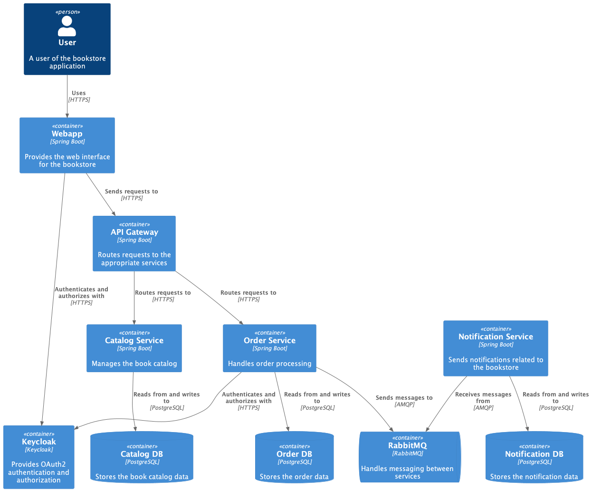

# Bookstore

A Spring Boot microservices demo project showcasing an online bookstore application.

It features separate services for catalog management, order processing, and notifications, all backed by PostgreSQL databases. The email notification works via RabbitMQ. The services are secured using Keycloak for OAuth2 authentication.

The project includes a web frontend and is easily deployable using Docker Compose, which also sets up the necessary infrastructure and monitoring tools like Prometheus, Loki, and Grafana.

## Project Structure



### Services
The project consists of the following services:

- `catalog-service`: Handles the catalog functionality of the bookstore. It connects to a PostgreSQL database (`catalog-db`) and exposes its API through the `api-gateway`.
- `order-service`: Manages the order processing for the bookstore. It communicates with the `catalog-service` via the `api-gateway`, connects to a PostgreSQL database (`orders-db`), and uses RabbitMQ (`bookstore-rabbitmq`) for messaging. It also integrates with Keycloak for OAuth2 authentication.
- `notification-service`: Responsible for sending email-based notifications related to the bookstore. It connects to a PostgreSQL database (`notifications-db`), uses RabbitMQ (`bookstore-rabbitmq`) for messaging, and integrates with a mail server (`mailpit`) for sending emails.
- `api-gateway`: Acts as the entry point for the bookstore API. It routes requests to the appropriate services (`catalog-service` and `order-service`).
- `webapp`: The web application frontend for the bookstore. It communicates with the backend services through the `api-gateway` and integrates with Keycloak for OAuth2 authentication.

### Infrastructure
The project includes the following infrastructure components:

- `catalog-db`, `orders-db`, `notifications-db`: PostgreSQL databases for the respective services.
- `bookstore-rabbitmq`: RabbitMQ message broker for communication between services.
- `mailpit`: A fake mail server for sending email notifications locally.
- `keycloak`: An OAuth2 authentication server for securing the services and web application.

### Monitoring
The project incorporates monitoring tools:

- `prometheus`: A monitoring system for collecting metrics from the services.
- `promtail`: A log collector that sends logs to Loki.
- `loki`: A log aggregation system for storing and querying logs.
- `tempo`: A distributed tracing system for analyzing request flows across services.
- `grafana`: A visualization platform for displaying metrics, logs, and traces collected by the monitoring tools.

#### Grafana

The projects include two demo dashboards for Grafana. And you can also explore the metrics, logs, and traces in Grafana.

### Configuration
The services are configured using environment variables, which are set in the `docker-compose.yml` file. The configuration includes database connection details, RabbitMQ settings, OAuth2 server URLs, and monitoring settings.

### Ports
The services expose their APIs on specific ports, which are mapped to the host machine. For example, the `catalog-service` is accessible on port 8081, and the `webapp` is accessible on port 8080.

This additional information provides a more comprehensive overview of the project structure, components, and their interactions based on the `docker-compose.yml` file.

Some interesting services that you can access on your local machine:

* `webapp`: Bookstore frontend, accessible at http://localhost:8080. Demo users: `azdanov/azdanov` and `anton/anton`.
* `mailpit`: Web interface for the mailpit service, accessible at http://localhost:8025 with no authentication.
* `keycloak`: Keycloak authentication server, accessible at http://localhost:9191 with credentials: `admin/admin`.
* `grafana`: Grafana visualization platform, accessible at http://localhost:3000 with credentials `admin/admin`.
* `bookstore-rabbitmq`: RabbitMQ management interface, accessible at http://localhost:15672 with credentials: `guest/guest`.

#### Hosts

Make sure to add the following entries to your `/etc/hosts` file when running the project locally:

Keycloak is needed for authentication to work.
And the other services are needed for the swagger documentation to work.

```txt
127.0.0.1 keycloak
127.0.0.1 catalog-service
127.0.0.1 order-service
127.0.0.1 api-gateway
```

## Task Commands

The project uses [Task](https://taskfile.dev/) as a task runner / build tool. The `Taskfile.yml` file defines various tasks for building, running, testing, and formatting the project.

### Building and Running

```shell
task start # Starts all services, infrastructure, and monitoring using Docker Compose.
task stop # Stops all services, infrastructure, and monitoring.
task restart # Restarts all services, infrastructure, and monitoring.
```

### Infrastructure and Monitoring

```shell
task start_infra # Starts only the infrastructure.
task stop_infra # Stops only the infrastructure.
task restart_infra # Restarts only the infrastructure.
task start_monitoring # Starts only the monitoring.
task stop_monitoring # Stops only the monitoring.
task restart_monitoring # Restarts only the monitoring.
```

### Testing and Formatting

```shell
task # The default task, which runs the test task.
task test # Runs all tests in the project.
task format # Applies code formatting rules to all Java files in the project.
```

## Docker Compose

The `deployment/compose.yml` file defines the Docker Compose configuration for the project. It includes definitions for all services, infrastructure, and monitoring.

## Further Information

For more detailed information, please refer to the individual `pom.xml` files in each service directory, the `Taskfile.yml` file, and the `compose.yml` file.


## Acknowledgements

This project is based on the [Spring Boot Microservices Course](https://github.com/sivaprasadreddy/spring-boot-microservices-course) by Siva Prasad Reddy and the accompanying [video course](https://www.youtube.com/playlist?list=PLuNxlOYbv61g_ytin-wgkecfWDKVCEDmB).
Many thanks to Siva Prasad Reddy for creating and sharing this valuable resource.
